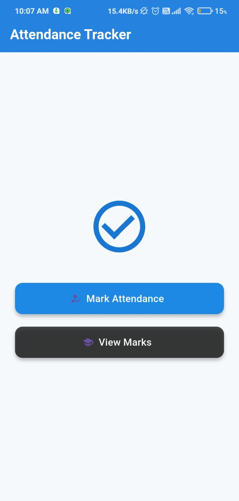

# 📘 Attendance Tracker App

A simple Flutter application for teachers to mark attendance and enter student marks with a clean UI. This project is part of **Assignment Phase 1** to demonstrate Dart programming concepts and Flutter UI development.

---

## 🚀 Features

- ✅ Mark attendance for students in different classes
- 📝 Log Present/Absent with date and time
- 📋 Submit attendance (non-editable after submission)
- 📊 View and enter student marks
- 💡 Clean and responsive UI

---

## 🛠️ Built With

- Flutter 💙
- Dart 🧠
- Google Fonts
- Material Design

---

## 🎯 Concepts Covered

- Dart Classes & Objects
- Loops & Control Structures
- Exception Handling
- State Management (using `setState`)
- Custom UI using Flutter widgets

---

## 📸 Screenshots

### 🔹 Home Page


### 🔹 Attendance Page


### 🔹 Marks Page


---

## 📦 Getting Started

1. **Clone the repository**
   ```bash
   git clone https://github.com/your-username/attendance-tracker.git
